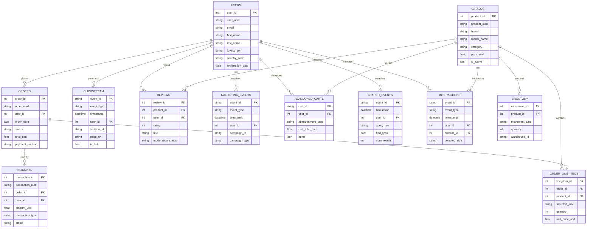
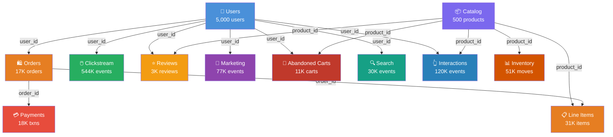

# KICKZ EMPIRE — Data Presentation

## Business Context

**KICKZ EMPIRE** is an e-commerce website specializing in **sneakers** and **streetwear** (Nike, Adidas, Jordan, New Balance, Puma). The site sells sneakers, hoodies, t-shirts, joggers, and accessories.

> You are a Data Engineer at KICKZ EMPIRE. The Data team is asking you to build an ELT pipeline to feed analytics dashboards and recommendation models.

### Key Figures (30 days: Feb 5 → Mar 7, 2026)

| Metric | Volume |
|---|---|
| Products in catalog | ~500 |
| Registered users | ~5,000 |
| Pageviews (clickstream) | ~544,000 |
| Product interactions | ~120,000 |
| Searches | ~30,000 |
| Orders | ~17,000 |
| Order line items | ~31,000 |
| Abandoned carts | ~11,000 |
| Inventory movements | ~51,000 |
| Customer reviews | ~3,000 |
| Marketing events (email) | ~77,000 |
| Payment transactions | ~18,000 |

---

## Source Data Architecture (Bronze)

---

## The 12 Datasets in Detail

### 1. 📦 Product Catalog (`products.csv`)

The KICKZ EMPIRE product catalog. This is the **main dimension table**.

| Column | Type | Description |
|---|---|---|
| `product_id` | INT (PK) | Unique identifier |
| `product_uuid` | STRING | UUID v4 |
| `brand` | STRING | Nike, Adidas, Jordan, New Balance, Puma |
| `model_name` | STRING | Model name (Air Max 90, Ultraboost…) |
| `colorway` | STRING | Product colorway |
| `category` | STRING | sneakers, hoodies, tees, joggers, accessories |
| `subcategory` | STRING | Detailed subcategory |
| `slug` | STRING | URL-friendly name |
| `display_name` | STRING | Full display name |
| `price_usd` | FLOAT | Selling price in USD |
| `available_sizes_json` | STRING | Available sizes (JSON encoded in CSV) |
| `weight_grams` | INT | Weight in grams |
| `is_active` | BOOL | Product active or not |
| `is_hype_product` | BOOL | Limited edition product |
| `created_at` | DATETIME | Creation date |
| `tags` | STRING | Tags separated by `\|` |
| `_internal_cost_usd` | FLOAT | ⚠️ Internal column (to be removed) |
| `_supplier_id` | STRING | ⚠️ Internal column |
| `_warehouse_location` | STRING | ⚠️ Internal column |
| `_internal_cost_code` | STRING | ⚠️ Internal column |

> **⚠️ Data Quality**: Columns prefixed with `_` are internal data that should not be exposed. The JSON-in-CSV and pipes (`|`) in tags require special parsing.

---

### 2. 👤 Users (`users.csv`)

Registered users/customers on KICKZ EMPIRE.

| Column | Type | Description |
|---|---|---|
| `user_id` | INT (PK) | Unique identifier |
| `user_uuid` | STRING | UUID v4 |
| `email` | STRING | Unique email |
| `first_name` / `last_name` | STRING | First and last name |
| `phone` | STRING | Phone number |
| `gender` | STRING | Gender |
| `date_of_birth` | DATE | Date of birth |
| `country_code` / `country_name` | STRING | Country |
| `city` | STRING | City |
| `address_line_1` / `address_line_2` | STRING | Address |
| `postal_code` | STRING | Postal code |
| `timezone` | STRING | Timezone |
| `registration_date` | DATE | Registration date |
| `is_verified` | BOOL | Email verified |
| `loyalty_tier` | STRING | bronze / silver / gold / platinum / **None** |
| `newsletter_opt_in` | BOOL | Newsletter subscriber |
| `preferred_language` | STRING | Language |
| `_hashed_password` | STRING | ⚠️ Sensitive data |
| `_ga_client_id` | STRING | ⚠️ Internal column |
| `_fbp` | STRING | ⚠️ Facebook pixel (40% NULL) |
| `_device_fingerprint` | STRING | ⚠️ Internal column |
| `_last_ip` | STRING | ⚠️ PII to be removed |
| `_failed_login_count` | INT | ⚠️ Internal column |
| `_account_flags` | INT | ⚠️ Internal bitmask |
| `_internal_segment_id` | STRING | ⚠️ Internal column |

> **⚠️ Data Quality**: 8 internal/PII columns to remove. `loyalty_tier` can be NULL. `address_line_2` often empty.

---

### 3. 🖱️ Clickstream (`clickstream/dt=YYYY-MM-DD/*.parquet`)

Web traffic — every pageview on the site. **Partitioned by day**.

| Column | Type | Description |
|---|---|---|
| `event_id` | STRING (PK) | Event UUID |
| `event_type` | STRING | `pageview` |
| `timestamp` | DATETIME | Timestamp |
| `user_id` | INT (FK, nullable) | NULL for bots and ~30% anonymous visitors |
| `session_id` | STRING | Session ID |
| `page_url` / `page_path` / `page_type` | STRING | Visited URL |
| `referrer_url` / `referrer_source` | STRING | Traffic source |
| `user_agent_raw` | STRING | Full User-Agent |
| `ip_address` | STRING | IP address |
| `viewport_width` / `viewport_height` | INT | Screen size |
| `is_bot` | BOOL | Bot traffic (~5%) |
| `_ga_client_id` | STRING | ⚠️ Internal column |
| `_dom_interactive_ms` / `_dom_complete_ms` / `_ttfb_ms` | FLOAT | ⚠️ Internal perf. metrics |
| … | … | 8 internal columns total |

> **⚠️ Data Quality**: **Partitioned Parquet** format (multi-file handling). Bot traffic mixed in (~5%). 30% of `user_id` NULL. Internal columns to filter.

---

### 4. 🛍️ Orders (`orders.csv`) & Order Line Items (`order_line_items.csv`)

Orders and their line-by-line breakdown.

**Orders:**

| Column | Type | Description |
|---|---|---|
| `order_id` | INT (PK) | Order identifier |
| `user_id` | INT (FK) | Customer |
| `order_date` | DATE | Order date |
| `status` | STRING | delivered / shipped / processing / returned / cancelled / chargeback |
| `subtotal_usd` / `shipping_cost_usd` / `tax_usd` / `total_usd` | FLOAT | Amounts |
| `coupon_code` | STRING | Promo code (often NULL) |
| `discount_amount_usd` | FLOAT | Discount amount |
| `payment_method` | STRING | Payment method |
| `shipping_method` | STRING | Shipping method |
| `_fraud_score` / `_stripe_*` / `_paypal_*` | … | ⚠️ 6 internal columns |

**Order Line Items:**

| Column | Type | Description |
|---|---|---|
| `line_item_id` | INT (PK) | Line item ID |
| `order_id` | INT (FK) | Order reference |
| `product_id` | INT (FK) | Product reference |
| `selected_size` / `colorway` | STRING | Selected size and colorway |
| `quantity` | INT | Quantity |
| `unit_price_usd` / `line_total_usd` | FLOAT | Unit price and line total |
| `_warehouse_id` / `_internal_batch_code` / `_pick_slot` | … | ⚠️ 3 internal columns |

> **⚠️ Data Quality**: 1-N relationship between orders and line_items. Multiple statuses to handle. Internal columns.

---

### 5. 💳 Payments (`payment_transactions.csv`)

Financial transactions linked to orders.

| Column | Type | Description |
|---|---|---|
| `transaction_id` | INT (PK) | Transaction ID |
| `order_id` | INT (FK) | Order reference |
| `amount_usd` | FLOAT | Amount (⚠️ **negative** for refunds) |
| `transaction_type` | STRING | charge / refund / chargeback |
| `status` | STRING | succeeded / failed / pending |
| `risk_score` | FLOAT | Risk score |
| `_card_brand` / `_card_last_four` / `_3ds_result` / … | … | ⚠️ 14 internal columns |

> **⚠️ Data Quality**: Negative amounts for refunds. 14 internal columns. Card fields NULL if non-card payment.

---

### 6. 📊 Inventory (`inventory_movements.csv`)

Stock movements across warehouses.

| Column | Type | Description |
|---|---|---|
| `movement_id` | INT (PK) | Movement ID |
| `product_id` | INT (FK) | Product reference |
| `warehouse_id` | STRING | Warehouse identifier |
| `movement_type` | STRING | purchase_order_received / sale / return / transfer_in / transfer_out / damaged_write_off / stock_adjustment_plus / stock_adjustment_minus |
| `quantity` | INT | Quantity (⚠️ **negative** for outgoing) |
| `timestamp` | DATETIME | Timestamp |
| `reference_id` | STRING | Order/PO/return reference |
| `_batch_code` / `_po_number` / … | … | ⚠️ 5 internal columns |

---

### 7. ⭐ Reviews (`reviews.jsonl`)

Customer reviews on products. **JSONL** format (one JSON per line).

| Field | Type | Description |
|---|---|---|
| `review_id` | INT (PK) | Review ID |
| `product_id` | INT (FK) | Product reference |
| `user_id` | INT (FK) | User reference |
| `rating` | INT | Rating 1-5 |
| `title` / `body` | STRING | Title and content (body can be NULL) |
| `verified_purchase` | BOOL | Verified purchase |
| `moderation_status` | STRING | approved / pending / rejected |
| `helpful_votes` | INT | Helpful votes |
| `_sentiment_raw` / `_toxicity_score` | FLOAT | ⚠️ Internal scores |

---

### 8. 📧 Marketing Events (`marketing_events.jsonl`)

Email marketing funnel. **JSONL** format.

| Field | Type | Description |
|---|---|---|
| `event_id` | STRING (PK) | Event ID |
| `event_type` | STRING | email_sent / email_delivered / email_opened / email_clicked / email_bounced |
| `user_id` | INT (FK) | User reference |
| `campaign_id` / `campaign_name` / `campaign_type` | STRING | Campaign details |
| `subject_line` | STRING | Email subject line |
| `clicked_url` | STRING | Clicked URL (NULL if not clicked) |
| `bounce_type` | STRING | Bounce type (NULL if not bounced) |
| `_esp_*` / `_smtp_response` / `_delivery_time_ms` | … | ⚠️ 6 internal columns |

---

### 9. 🛒 Abandoned Carts (`abandoned_carts.jsonl`)

Abandoned shopping carts. **JSONL** format with **nested array**.

| Field | Type | Description |
|---|---|---|
| `cart_id` | STRING (PK) | Cart ID |
| `user_id` | INT (FK, nullable) | NULL for ~20% anonymous users |
| `abandonment_step` | STRING | Abandonment step in the funnel |
| `cart_total_usd` | FLOAT | Total amount |
| `items` | ARRAY[OBJECT] | ⚠️ **Nested array** of products |
| `recovery_email_sent` | BOOL | Recovery email sent |
| `cart_recovered` | BOOL | Cart recovered |
| `recovered_order_id` | INT (FK) | Order reference if recovered |

> **⚠️ Data Quality**: The `items` field is a **nested JSON** (array of objects) — requires flatten/unnest.

---

### 10. 🔍 Search Events (`search_events.jsonl`)

Site searches. **JSONL** format.

| Field | Type | Description |
|---|---|---|
| `event_id` | STRING (PK) | Event ID |
| `user_id` | INT (FK, nullable) | NULL for ~35% anonymous users |
| `query_raw` | STRING | Raw query (with typos!) |
| `query_normalized` | STRING | Corrected query |
| `had_typo` | BOOL | Contains a typo |
| `num_results` | INT | Number of results |
| `clicked_product_id` | INT (FK, nullable) | Clicked product |
| `filters_applied_json` | STRING | Applied filters (JSON string or NULL) |

---

### 11. 👆 Product Interactions (`interactions.parquet`)

User interactions with products. **Parquet** format.

| Column | Type | Description |
|---|---|---|
| `event_id` | STRING (PK) | Event ID |
| `event_type` | STRING | add_to_cart / wishlist / size_select / color_select / quick_view / zoom |
| `user_id` | INT (FK, nullable) | NULL for ~25% anonymous users |
| `product_id` | INT (FK) | Product reference |
| `selected_size` | STRING | Size (NULL except for size_select) |
| `quantity` | INT | Quantity (NULL except for add_to_cart) |

---

## Data Flow — Target ELT Pipeline

```mermaid
flowchart LR
    subgraph SOURCES["☁️ S3 Data Lake (s3://kickz-empire-data/raw/)"]
        CSV["📄 CSV\nproducts, users,\norders, line_items,\ninventory, payments"]
        JSONL["📋 JSONL\nreviews, search,\nmarketing, carts"]
        PARQUET["📊 Parquet\nclickstream,\ninteractions"]
    end

    subgraph BRONZE["🥉 Bronze Layer\n(Raw — faithful to source)"]
        B1["bronze.products"]
        B2["bronze.users"]
        B3["bronze.orders"]
        B4["bronze.order_line_items"]
        B5["bronze.payments"]
        B6["bronze.inventory"]
        B7["bronze.reviews"]
        B8["bronze.clickstream"]
        B9["bronze.interactions"]
        B10["bronze.search_events"]
        B11["bronze.marketing_events"]
        B12["bronze.abandoned_carts"]
    end

    subgraph SILVER["🥈 Silver Layer\n(Cleaned + Conformed)"]
        S1["silver.dim_products\n- _ columns removed\n- Sizes parsed\n- Tags normalized"]
        S2["silver.dim_users\n- PII removed\n- Tiers normalized"]
        S3["silver.fct_orders\n- Statuses validated\n- Enriched join"]
        S4["silver.fct_order_lines\n- Product join"]
        S5["silver.fct_payments\n- Types normalized"]
        S6["silver.fct_inventory\n- Signed quantities"]
        S7["silver.fct_reviews\n- Moderation filtered"]
        S8["silver.fct_clickstream\n- Bots excluded\n- Sessions enriched"]
    end

    subgraph GOLD["🥇 Gold Layer\n(Aggregated — Business Ready)"]
        G1["gold.daily_revenue\nRevenue per day"]
        G2["gold.product_performance\nTop products, conversion"]
        G3["gold.customer_ltv\nCustomer Lifetime Value"]
        G4["gold.funnel_analysis\nConversion funnel"]
        G5["gold.inventory_status\nCurrent stock per product"]
        G6["gold.campaign_performance\nMarketing ROI"]
    end

    CSV --> BRONZE
    JSONL --> BRONZE
    PARQUET --> BRONZE

    BRONZE --> SILVER
    SILVER --> GOLD
```

---

## File Formats & Technical Challenges

| Format | Datasets | Challenges |
|---|---|---|
| **CSV** | products, users, orders, line_items, inventory, payments | JSON inside CSV, pipes `\|` as separator, NULL values |
| **JSONL** | reviews, search, marketing, carts | Nested objects (carts.items), conditionally NULL fields |
| **Parquet** | clickstream (partitioned), interactions | Multi-file partitions, reading with PyArrow/pandas |

## Data Quality Issues to Address

| Issue | Affected Datasets | Action |
|---|---|---|
| **Internal columns (`_` prefix)** | All | Remove `_*` columns |
| **PII / sensitive data** | users (`_hashed_password`, `_last_ip`) | Remove or mask |
| **NULL values** | user_id in clickstream/search/interactions/carts | Handle anonymous users |
| **Bot traffic** | clickstream (~5%) | Filter `is_bot = True` |
| **Negative amounts** | payments (refunds), inventory (outgoing) | Validate business logic |
| **Nested JSON** | abandoned_carts (items[]) | Flatten / unnest |
| **JSON inside CSV** | catalog (available_sizes_json, tags) | Parse and normalize |
| **Intentional typos** | search_events (query_raw) | Normalize queries |
| **Conditional data** | Multiple (clicked_url if clicked, etc.) | Validate consistency |

---

## Table Relationships

---

> **Next step**: TP 1 — Environment setup (AWS RDS PostgreSQL + S3) + Bronze data extraction
